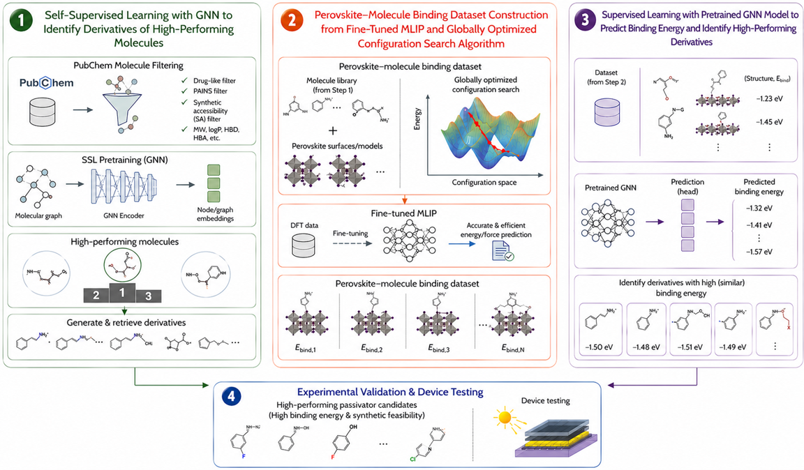

# perov-passivator

Deep learning pipeline for **Lewis-base passivator** discovery: contrastive self-supervised pretraining of a charge-aware **GIN-E** graph encoder on large molecular corpora, fine-tuning for **perovskite binding energy** prediction, and downstream search/analysis over candidate molecules.

<p align="center">
  
</p>
<p align="center"><em>Pipeline summary — from PubChem-scale molecules to binding-energy prediction, neighbor search, and procurement-oriented analysis.</em></p>

## Overview

| Stage | What it does |
|-------|----------------|
| **SSL pretraining** | Learn molecular representations from PubChem-scale SMILES via augmented graph pairs (NT-Xent) |
| **Downstream fine-tuning** | Predict adsorption / binding energy from merged DFT + structure CSVs |
| **Inference** | Batch or single-molecule binding energy from SMILES; optional embedding export |
| **kNN search** | Find nearest neighbors in SSL or finetuned embedding space |
| **Analysis** | Anchor functional-group statistics, t-SNE, error plots, literature mining |
| **Agent skills** | Reusable Cursor skills for filtering, neighbor search, binding-energy prediction, and vendor/salt lookup |

Central configuration lives in [`config.py`](config.py) (data paths, model dims, training hyperparameters). Paths default to HPC scratch; override for local runs.

## Installation

```bash
git clone https://github.com/kevin-ymx/perov-passivator.git
cd perov-passivator
pip install -r requirements.txt
```

**Core stack:** Python 3.8+, PyTorch 2.0+, PyTorch Geometric, RDKit, NumPy, SciPy, scikit-learn, matplotlib, tqdm.

Optional: `opentsne`, `plotly` (t-SNE / interactive plots); `openai` (literature extraction and `mol-salt-vendor` skill).

On Windows, use `python3` if `python` points to Python 2.

## Quick start

### 1. SSL pretraining

```bash
# Build augmented graph cache from a PubChem CSV (PUBCHEM_COMPOUND_CID, SMILES)
python dataset/ssl/build_graph_cache.py --csv_file molecules.csv --cache_dir ./cache

# Train GIN-E encoder (set config.use_cache = True in config.py when using cache)
python train_ssl.py
```

Checkpoint: `checkpoints/best_model.pt`.

### 2. Downstream binding-energy training

```bash
python train_downstream.py
```

Uses `config.downstream_csv` (merged CSV with `cid`, `SMILES`, `adsorption_energy`, `pb_bond_encoding`, `adsorbate_structure`, etc.). Best model: `checkpoints/downstream/downstream_best_model.pt`.

### 3. Predict binding energy

```bash
# Single SMILES
python inference_Eb.py --smiles "CCO"

# Batch CSV
python inference_Eb.py --csv input.csv --output predictions.csv

# Shard directory of filtered PubChem CSVs (+ optional embeddings only)
python inference_Eb.py --filtered_csv ./filtered_csv_latest --output_dir ./filtered_csv_Eb
```

### 4. kNN in embedding space

```bash
# Nearest neighbors in SSL embedding space
python knn_sslembedding_search.py \
  --query_csv molecules_cid_smiles.csv \
  --embedding_dir path/to/embeddings \
  --checkpoint checkpoints/best_model.pt \
  --output knn_results.csv

# Diamine-focused query subset (EDA, PDA, CyDA, Piperazine)
python knn_sslembedding_search.py --diamine_queries --output knn_diamine.csv

# Nearest neighbors in finetuned GIN-E embedding space
python knn_finetunedembedding_search.py \
  --query_csv molecules_cid_smiles_finetuned.csv \
  --embedding_dir path/to/finetuned_embeddings \
  --checkpoint checkpoints/downstream/gin_e_finetuned.pt \
  --output knn_finetuned_results.csv
```

Use the SSL search for representation neighbors from `checkpoints/best_model.pt`.
Use the finetuned search when the reference embeddings were generated by the
finetuned GIN-E encoder used for binding-energy downstream training.

Related: `knn_strong_binders.py`, `filter_AL_knn.py`.

## Analysis & visualization

### Binding-anchor statistics

`analyze_binding_anchors.py` reads a merged downstream CSV and writes violin plots plus per-group CSV summaries.

```bash
python analyze_binding_anchors.py --input path/to/merged.csv --output_dir logs/binding_anchor_stats
python analyze_binding_anchors.py --min_group_size 5 --energy_min -3.0 --energy_max 0
```

**Plot 1** — anchor combinations (N / O / S / P). **Plots 2–5** — single-anchor functional groups per element (RDKit-detected at the resolved anchor atom).

Other plotting scripts: `visualize_tsne.py`, `visualize_tsne_downstream.py`, `plot_binding_energy_histogram.py`, `plot_test_error_violin.py`, `plot_knn_molecule_images.py`, `plot_strong_binder_sample.py`.

## Literature pipeline

Scripts under `dataset/literature/` extract passivator molecules from paper abstracts (LLM + PubChem lookup):

- `abs_extract.py` — parse WOS-style abstracts → JSON/CSV
- `clean_molecule_names.py` — filter generic vs specific molecule names
- `journal_summary.py`, `plot_journal_summary.py` — journal-level stats

Set `OPENAI_API_KEY` in the environment (never commit keys).

## Comparison experiments

Self-contained ablation folders mirror the main pipeline with different node-feature sets:

| Folder | Focus |
|--------|--------|
| `comparison_2feat/` | Two-feature encoder variant |
| `comparison_3feat_coordination/` | + coordination number |
| `comparison_3feat_electronegativity/` | + electronegativity |
| `comparison_3feat_partial_charge/` | + partial charge |

Each contains its own `config.py`, `train_ssl.py`, `train_downstream.py`, and Slurm inference scripts.

## Agent skills

Portable skills under [`skills/`](skills/) for Cursor and other agents. See [`skills/README.md`](skills/README.md).

| Skill | Purpose |
|-------|---------|
| [`pubchem-mol-filter`](skills/pubchem-mol-filter/SKILL.md) | Configurable RDKit filtering of PubChem CSV shards (local or HPC Slurm) |
| [`ssl-neighbor-search`](skills/ssl-neighbor-search/SKILL.md) | kNN molecule neighbor search in SSL GIN-E embedding space |
| [`finetuned-neighbor-search`](skills/finetuned-neighbor-search/SKILL.md) | kNN molecule neighbor search in finetuned GIN-E embedding space |
| [`eb-pbcoord-predict`](skills/eb-pbcoord-predict/SKILL.md) | Binding-energy prediction for Lewis-base coordination to undercoordinated Pb on FAPbI3 |
| [`mol-salt-vendor`](skills/mol-salt-vendor/SKILL.md) | OpenAI + web search: free-base physical form, vendors, HCl/HBr/HI salt availability (local, API key) |

## Project structure

```
perov-passivator/
├── config.py                      # Shared configuration
├── train_ssl.py                   # SSL pretraining
├── train_downstream.py            # Binding-energy fine-tuning
├── inference_Eb.py                # Binding energy inference (+ embeddings)
├── inference_ssl.py               # SSL embedding export
├── knn_sslembedding_search.py     # kNN in SSL embedding space
├── knn_finetunedembedding_search.py # kNN in finetuned embedding space
├── analyze_binding_anchors.py     # Anchor / functional-group violins
├── models/
│   ├── gin_e.py                   # GIN-E encoder
│   └── downstream_model.py        # Encoder + MLP heads
├── dataset/
│   ├── ssl/                       # Graph cache, filters, augmentation
│   ├── prediction/                # Downstream CSV prep, sampling
│   └── literature/                # Abstract extraction & cleaning
├── comparison_2feat/              # Feature ablation experiments
├── comparison_3feat_*/            # 3-feature ablation variants
├── checkpoints/                   # SSL + downstream model weights
├── skills/                        # Agent skills (filtering, kNN, prediction, vendor lookup)
└── requirements.txt
```

## Data formats

**SSL / PubChem filtering:** CSV with `PUBCHEM_COMPOUND_CID` (or `cid`) and `SMILES` (or `smiles`).

**Downstream training / anchor analysis:** merged CSV with (case-insensitive) `cid`, `SMILES`, `pb_bond_encoding`, `adsorption_energy`, `adsorbate_structure` (JSON with `elements.number`, ideally `coords.3d`).

**Inference input:** CSV with SMILES; optional reference energy column for parity plots.

**kNN query CSV:** `molecule_name`, `cid`, `smiles`, `journal` (see `knn_sslembedding_search.py` and `knn_finetunedembedding_search.py`).

## Configuration

Edit [`config.py`](config.py) before training:

- **SSL:** `csv_file`, `cache_dir`, `use_cache`, augmentation ratios, GIN-E architecture, `temperature`, epochs
- **Downstream:** `downstream_csv`, graph cache paths, train/val/test splits, `freeze_pretrained_encoder`, rare-binder loss weight
- **Inference:** checkpoint paths (via CLI flags or defaults in scripts)

For extended architecture notes, see [`PROJECT_EXTENSION.md`](PROJECT_EXTENSION.md).

## License

MIT License

## Acknowledgments

PyTorch Geometric, RDKit, PubChem, OpenAI API (literature extraction and vendor lookup skill).
