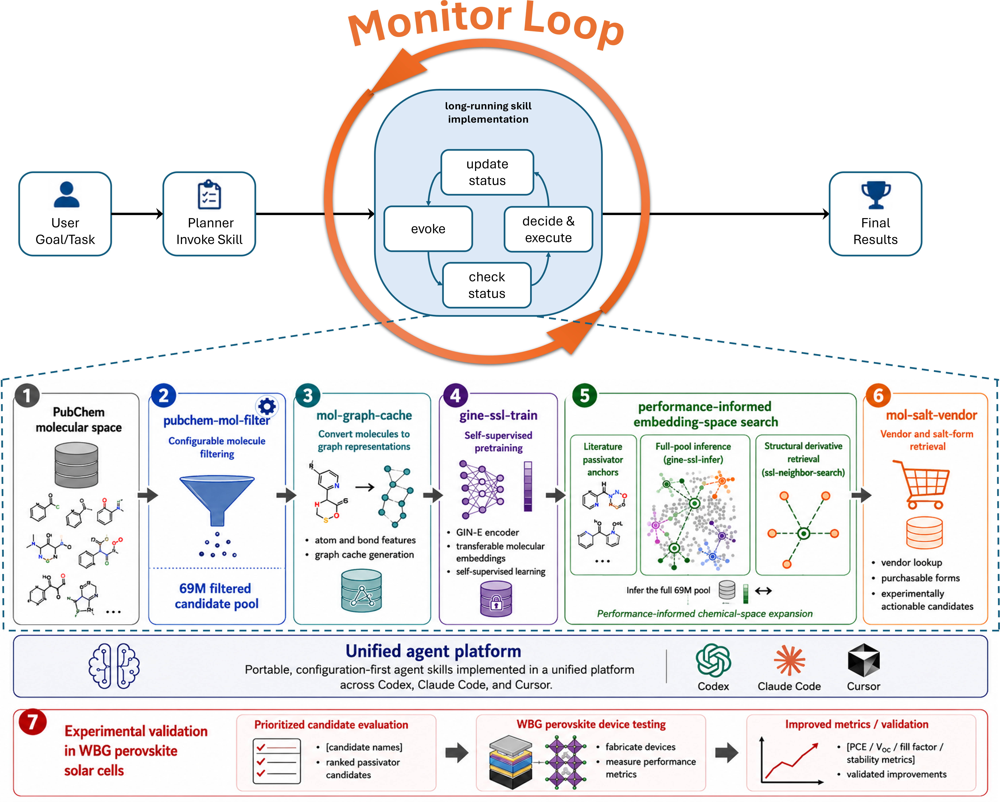
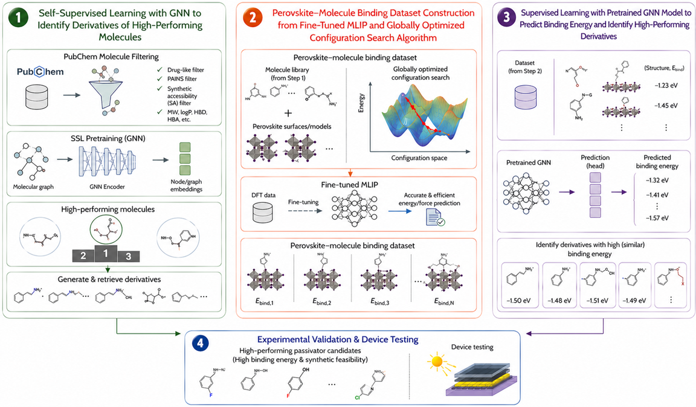

# perov-passivator

This repository contains two complementary research sections for molecular
passivator discovery in perovskite solar cells:

1. **Loop-orchestrated agent-skills discovery:** a configuration-first,
   restartable workflow that filters PubChem, learns molecular embeddings,
   retrieves promising derivatives, and identifies purchasable salt forms.
2. **SSL plus downstream binding-energy prediction:** a GIN-E molecular
   representation pipeline that combines self-supervised pretraining with
   supervised prediction of molecule-perovskite binding energy (`E_b`).

The two sections share molecular graph representations and GIN-E encoders, but
serve different scientific purposes. Section 1 expands and operationalizes the
candidate search space. Section 2 predicts and ranks candidates using
surface-interaction data.

| Section | Primary goal | Main output |
|---|---|---|
| Agent-skills discovery | Discover structurally related, experimentally actionable passivators at PubChem scale | Ranked derivatives and vendor-validated salt forms |
| Binding-energy prediction | Learn and predict molecule-perovskite surface interactions | Molecular `E_b` predictions, rankings, and embeddings |

## Installation

```bash
git clone https://github.com/kevin-ymx/perov-passivator.git
cd perov-passivator
pip install -r requirements.txt
```

Core dependencies include Python 3.8+, PyTorch, PyTorch Geometric, RDKit,
NumPy, SciPy, scikit-learn, matplotlib, and tqdm. Slurm is required for the
provided GPU/HPC job workflows. The vendor-lookup stage additionally requires
the OpenAI Python package and an `OPENAI_API_KEY`.

## Section 1: Loop-Orchestrated Agent-Skills Discovery

<p align="center">
  
</p>
<p align="center"><em>Overview of the persistent agent loop, six-stage molecular discovery workflow, and experimental validation path.</em></p>

This section implements a modular scientific workflow for discovering
passivator derivatives from the PubChem molecular space. Each stage is a
standalone agent skill with an explicit configuration, approval gate, execution
script, and validated output artifact. The stages can be run individually or
connected through the `pipeline-automation` skill.

### Discovery workflow

| Stage | Skill | Scientific task | Primary artifact |
|---|---|---|---|
| 1 | [`pubchem-mol-filter`](skills/pubchem-mol-filter/SKILL.md) | Apply configurable chemical-validity, composition, molecular-weight, heavy-atom, and ring restrictions | Filtered molecule CSV shards |
| 2 | [`mol-graph-cache`](skills/mol-graph-cache/SKILL.md) | Convert SMILES batches into PyTorch Geometric graphs with selectable atom and bond features | Molecular graph caches |
| 3 | [`gine-ssl-train`](skills/gine-ssl-train/SKILL.md) | Train a GIN-E encoder with fixed-pair contrastive self-supervised learning | Trained encoder checkpoint |
| 4 | [`gine-ssl-infer`](skills/gine-ssl-infer/SKILL.md) | Infer embeddings for a single CSV or a sharded molecular pool on GPUs | Molecular embedding shards |
| 5 | [`ssl-neighbor-search`](skills/ssl-neighbor-search/SKILL.md) | Retrieve structural derivatives near literature or performance anchors in embedding space | Neighbor and deduplicated candidate tables |
| 6 | [`mol-salt-vendor`](skills/mol-salt-vendor/SKILL.md) | Identify free-base and HCl/HBr/HI forms, vendors, and purchase sources | Experimentally actionable vendor table |

The artifacts form an explicit handoff chain:

```text
PubChem CSV shards
  -> filtered molecule shards
  -> molecular graph caches
  -> GIN-E SSL checkpoint
  -> full-pool embedding shards
  -> nearest-neighbor candidates
  -> vendor-validated free-base and halide-salt forms
```

### Persistent orchestration

[`pipeline-automation`](skills/pipeline-automation/SKILL.md) provides the
execution layer for long-running local and Slurm stages. An agent first drafts
the scientific and pipeline configurations from the research request. The user
reviews the complete configurations and enables execution by setting
`"confirmed": true`. The controller then:

1. checks dependencies, Slurm state, expected outputs, and final success markers;
2. selects the first ready or retry-ready stage;
3. runs a command or submits a Slurm job;
4. records the new state in `pipeline_status.json`;
5. appends an auditable event to `pipeline_journal.jsonl`.

Cron can invoke the deterministic controller at a fixed interval on the HPC
login or scheduler node. Completed stages are skipped. Partial artifacts do not
complete an active job, and a final success marker is required when restart
skipping is enabled. Slurm `TIMEOUT` is treated as a restartable interruption;
hard failures follow the configured retry and stop policy.

```bash
# Create and review a pipeline configuration
python skills/pipeline-automation/scripts/pipeline_controller.py \
  --write-config runs/passivator_discovery/pipeline_config.json

# Initialize persistent state after confirming the configuration
python skills/pipeline-automation/scripts/pipeline_controller.py \
  --pipeline-config runs/passivator_discovery/pipeline_config.json \
  --status runs/passivator_discovery/pipeline_status.json \
  --init-status

# Execute one controller pass
python skills/pipeline-automation/scripts/pipeline_controller.py \
  --pipeline-config runs/passivator_discovery/pipeline_config.json \
  --status runs/passivator_discovery/pipeline_status.json \
  --execute

# Preview the recurring monitor entry before installing it
python skills/pipeline-automation/scripts/cron_manager.py \
  --pipeline-config runs/passivator_discovery/pipeline_config.json \
  --status runs/passivator_discovery/pipeline_status.json \
  --print
```

Each scientific skill has its own templates, examples, dependencies, and
runtime scripts under [`skills/`](skills/). See
[`skills/README.md`](skills/README.md) for the full skill index.

## Section 2: SSL and Binding-Energy Prediction

<p align="center">
  
</p>
<p align="center"><em>Overview of SSL molecular representation learning, binding-dataset construction, supervised E_b prediction, and experimental validation.</em></p>

This section uses a charge-aware GIN-E encoder to learn molecular
representations and predict molecule-perovskite binding energies. SSL
pretraining first learns transferable embeddings from augmented molecular graph
pairs. The pretrained encoder is then incorporated into a supervised downstream
model trained on molecule-surface configurations and binding energies generated
from the fine-tuned MLIP workflow. The resulting surrogate supports rapid
`E_b` inference, candidate ranking, embedding export, and local-neighborhood
analysis.

### 1. SSL pretraining

```bash
# Build an augmented graph cache from a molecule CSV
python dataset/ssl/build_graph_cache.py \
  --csv_file molecules.csv \
  --cache_dir ./cache

# Set the desired paths and hyperparameters in config.py, then train
python train_ssl.py
```

The best SSL encoder is written to `checkpoints/best_model.pt` by default.

### 2. Downstream binding-energy training

```bash
python train_downstream.py
```

The downstream dataset path and training options are defined in
[`config.py`](config.py). Expected fields include molecule identifiers, SMILES,
binding energies, Pb-bond encodings, and adsorbate structures. The default best
checkpoint is `checkpoints/downstream/downstream_best_model.pt`.

### 3. Binding-energy inference

```bash
# Single molecule
python inference_Eb.py --smiles "CCO"

# Batch prediction
python inference_Eb.py --csv input.csv --output predictions.csv

# Sharded full-pool inference
python inference_Eb.py \
  --filtered_csv ./filtered_csv_latest \
  --output_dir ./filtered_csv_Eb
```

[`eb-pbcoord-predict`](skills/eb-pbcoord-predict/SKILL.md) provides a
configuration-driven interface for predicting and ranking Lewis-base binding to
undercoordinated Pb sites using a compatible downstream checkpoint.

### 4. Embedding-space search

```bash
# Search representations learned by the SSL encoder
python knn_sslembedding_search.py \
  --query_csv molecules_cid_smiles.csv \
  --embedding_dir path/to/ssl_embeddings \
  --checkpoint checkpoints/best_model.pt \
  --output knn_ssl_results.csv

# Search representations from the binding-energy-finetuned encoder
python knn_finetunedembedding_search.py \
  --query_csv molecules_cid_smiles_finetuned.csv \
  --embedding_dir path/to/finetuned_embeddings \
  --checkpoint checkpoints/downstream/gin_e_finetuned.pt \
  --output knn_finetuned_results.csv
```

Use SSL embeddings for general structural and chemical-context similarity. Use
finetuned embeddings when similarity should reflect features learned from the
binding-energy task. The reusable interface for the latter is
[`finetuned-neighbor-search`](skills/finetuned-neighbor-search/SKILL.md).

Related utilities include `knn_strong_binders.py` and `filter_AL_knn.py`.

### Analysis and visualization

```bash
python analyze_binding_anchors.py \
  --input path/to/merged.csv \
  --output_dir logs/binding_anchor_stats
```

`analyze_binding_anchors.py` summarizes binding-energy distributions for N, O,
S, and P anchor combinations and RDKit-resolved functional groups. Additional
visualization scripts include:

- `visualize_tsne.py`
- `visualize_tsne_downstream.py`
- `plot_binding_energy_histogram.py`
- `plot_test_error_violin.py`
- `plot_knn_molecule_images.py`
- `plot_strong_binder_sample.py`

### Feature ablations

Self-contained comparison directories reproduce the SSL and downstream pipeline
with different molecular node-feature sets:

| Directory | Feature experiment |
|---|---|
| `comparison_2feat/` | Two-feature encoder baseline |
| `comparison_3feat_coordination/` | Adds coordination number |
| `comparison_3feat_electronegativity/` | Adds electronegativity |
| `comparison_3feat_partial_charge/` | Adds partial charge |

## Shared Data and Configuration

### Data formats

- **PubChem and SSL inputs:** CSV with `PUBCHEM_COMPOUND_CID` or `cid`, plus
  `SMILES` or `smiles`.
- **Graph caches:** PyTorch `.pt` files containing PyTorch Geometric molecular
  graphs and feature metadata.
- **Embedding pools:** CSV shards containing molecule identifiers, SMILES, and
  encoder embedding dimensions.
- **Downstream training:** merged CSV containing case-insensitive `cid`,
  `SMILES`, `pb_bond_encoding`, `adsorption_energy`, and
  `adsorbate_structure`.
- **Inference inputs:** a single SMILES, a CSV, or a directory of CSV shards.
- **Pipeline state:** `pipeline_config.json`, `pipeline_status.json`, and
  `pipeline_journal.jsonl`.

### Configuration layers

- [`config.py`](config.py) controls the native SSL, downstream, and inference
  pipeline, including paths, model dimensions, splits, augmentation, loss, and
  training hyperparameters.
- Each agent skill uses an explicit JSON run configuration under its own skill
  directory. Skills with approval gates execute only after
  `"confirmed": true`.
- Slurm-enabled skills separate scientific run settings from cluster resource
  settings so the same workflow can be transferred between HPC environments.

For extended model notes, see
[`PROJECT_EXTENSION.md`](PROJECT_EXTENSION.md).

## Repository Structure

```text
perov-passivator/
|-- README.md
|-- config.py
|-- train_ssl.py
|-- train_downstream.py
|-- inference_ssl.py
|-- inference_Eb.py
|-- knn_sslembedding_search.py
|-- knn_finetunedembedding_search.py
|-- analyze_binding_anchors.py
|-- models/
|   |-- gin_e.py
|   `-- downstream_model.py
|-- dataset/
|   |-- ssl/
|   |-- prediction/
|   `-- literature/
|-- comparison_2feat/
|-- comparison_3feat_coordination/
|-- comparison_3feat_electronegativity/
|-- comparison_3feat_partial_charge/
|-- skills/
|   |-- pubchem-mol-filter/
|   |-- mol-graph-cache/
|   |-- gine-ssl-train/
|   |-- gine-ssl-infer/
|   |-- ssl-neighbor-search/
|   |-- mol-salt-vendor/
|   |-- pipeline-automation/
|   |-- eb-pbcoord-predict/
|   `-- finetuned-neighbor-search/
|-- docs/figures/
|   |-- loop.png
|   `-- workflow.png
|-- checkpoints/
`-- requirements.txt
```

## Literature Utilities

Scripts under `dataset/literature/` extract and curate passivator molecules from
publication abstracts:

- `abs_extract.py`
- `clean_molecule_names.py`
- `journal_summary.py`
- `plot_journal_summary.py`

Set `OPENAI_API_KEY` in the environment when using LLM-based extraction. Never
commit API keys, account credentials, or private HPC paths.

## License

MIT License

## Acknowledgments

This project builds on PyTorch, PyTorch Geometric, RDKit, PubChem, Slurm, and
the OpenAI API.
